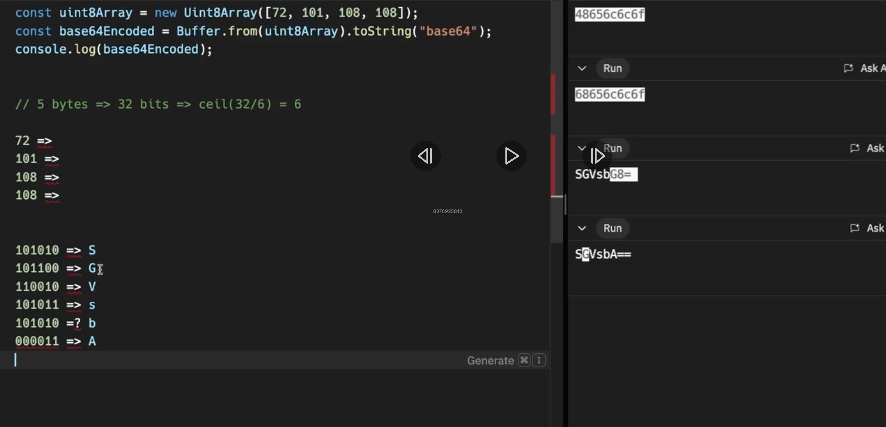
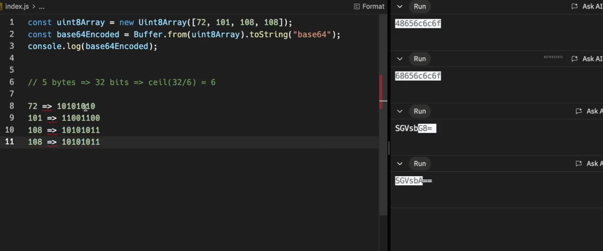

# 📦 Encodings — Detailed Theory Notes (Simple & Clear)

---

## 🔹 Why Do We Need Encodings?

Computers **only understand bytes (0s and 1s)**, but humans don’t.

Imagine saying:

```
My name is 00101011101010101010
```

That’s unreadable for humans.

👉 **Encodings** are systems that:

* Convert **raw bytes (binary data)** into **human-readable characters**
* Allow data to be **stored, displayed, shared, and transmitted safely**

Encodings answer the question:

> “How do we map numbers (bytes) to characters that humans can read?”

---

## 🔹 What Is an Encoding?

An **encoding** is a **rulebook** that defines:

* Which **bit patterns**
* Map to which **characters or symbols**

Different encodings exist because:

* Some optimize for **simplicity**
* Some for **compactness**
* Some for **human readability**
* Some for **safe transmission**

---

# 🅰️ ASCII Encoding

---

## 🔹 What is ASCII?

**ASCII (American Standard Code for Information Interchange)**
It is one of the **oldest and simplest encodings**.

### Key Idea

Each character (letter, number, symbol) is represented by a **number**.

---

## 🔹 How many bits does ASCII use?

* **1 ASCII character = 7 bits**
* Possible values:

  ```
  2⁷ = 128 characters
  ```

### ASCII Range

* `0` to `127`

---

## 🔹 What does ASCII include?

ASCII covers:

* Capital letters → A–Z
* Small letters → a–z
* Numbers → 0–9
* Symbols → `! @ # $ %`
* Control characters → newline, tab, etc.

📌 Example (conceptual):

* `A` → 65
* `a` → 97
* `0` → 48

---

## 🔹 Important Detail: ASCII and Bytes

Even though ASCII uses **7 bits**, computers store data in **bytes (8 bits)**.

So:

* ASCII characters are usually stored in **1 byte**
* The **extra 1 bit is unused (or 0)**

---

## 🔹 ASCII Summary

| Property           | Value        |
| ------------------ | ------------ |
| Bits per character | 7 bits       |
| Max characters     | 128          |
| Bytes used         | 1 byte       |
| Language support   | English only |
| Age                | Very old     |

---

# 🔢 Hexadecimal (Hex)

---

## 🔹 What is Hex?

**Hexadecimal (base-16)** is **not a character encoding for text**, but a **representation of bytes**.

It exists to make **binary data readable**.

---

## 🔹 How many bits does Hex use?

* **1 hex character = 4 bits**
* Possible values:

  ```
  2⁴ = 16
  ```

---

## 🔹 Hex Character Set

Hex digits:

```
0 1 2 3 4 5 6 7 8 9 A B C D E F
```

Where:

* `A = 10`
* `F = 15`

---

## 🔹 Relationship Between Hex and Bytes

* **1 byte = 8 bits**
* **1 hex character = 4 bits**

So:

```
1 byte = 2 hex characters
```

Example:

```
11111111 (binary)
= FF (hex)
```

---

## 🔹 Why Hex is Used

Hex is commonly used for:

* Debugging
* Memory addresses
* Hashes (SHA, MD5)
* Color codes (#FF5733)

Because:

* It’s **shorter than binary**
* Still **maps cleanly to bits**

---

## 🔹 Hex Summary

| Property           | Value              |
| ------------------ | ------------------ |
| Bits per character | 4 bits             |
| Characters         | 16                 |
| Text encoding?     | ❌ No               |
| Purpose            | Binary readability |
| 1 byte equals      | 2 hex characters   |

---

# 🧱 Base64 Encoding

---


## 🔹 What is Base64?

**Base64** is an encoding used to:

* Safely transmit **binary data**
* Over systems that only support **text**

Example use cases:

* Email attachments
* Images in HTML
* JWT tokens

---

## 🔹 How many bits does Base64 use?

* **1 Base64 character = 6 bits**
* Possible values:

  ```
  2⁶ = 64
  ```

---

## 🔹 Base64 Character Set (64 characters)

* `A–Z` → 26
* `a–z` → 26
* `0–9` → 10
* `+` and `/` → 2

Total = **64**

---

## 🔹 How Base64 Packs Data

* **3 bytes (24 bits)** are grouped together
* Split into **4 Base64 characters**

  ```
  24 bits ÷ 6 = 4 characters
  ```

📌 This is why Base64 **increases size by ~33%**.

---

## 🔹 Why Base64 Exists

Some systems:

* Break on binary data
* Expect only printable characters

Base64 ensures:

* Data stays intact
* Uses only safe characters

---

## 🔹 Base64 Summary

| Property           | Value               |
| ------------------ | ------------------- |
| Bits per character | 6 bits              |
| Characters         | 64                  |
| Size impact        | Increases data size |
| Use case           | Binary → text       |
| Human readable     | Partially           |






---

# 🔐 Base58 Encoding

---

## 🔹 What is Base58?

Base58 is **similar to Base64**, but designed to be:

* More **human-friendly**
* Less error-prone

Popular in:

* Bitcoin
* Blockchain addresses

---

## 🔹 How many bits does Base58 use?

* **1 Base58 character ≈ 5.86 bits**
* Because:

  ```
  log₂(58) ≈ 5.86
  ```

(Not a perfect power of 2)

---

## 🔹 Base58 Character Set

It **removes confusing characters**:

❌ Removed:

* `0` (zero)
* `O` (capital o)
* `I` (capital i)
* `l` (small L)
* `+` and `/`

✅ Includes:

* A–Z (except I, O)
* a–z (except l)
* 1–9 (no 0)

---

## 🔹 Why Base58 Is Better for Humans

Avoids mistakes like:

* `0` vs `O`
* `l` vs `I`

Very important when:

* Copying addresses
* Reading from paper
* Manual entry

---

## 🔹 Base58 Summary

| Property           | Value  |
| ------------------ | ------ |
| Bits per character | ~5.86  |
| Characters         | 58     |
| Human friendly     | ✅ Yes  |
| Used in            | Crypto |
| Safer than Base64  | ✅      |

---

# 🆚 ASCII vs UTF-8

---

## 🔹 ASCII

* Fixed **7-bit encoding**
* Only supports **English**
* Very limited
* Old standard

---

## 🔹 UTF-8

UTF-8 is a **variable-length encoding**.

### How many bytes per character?

* **1 to 4 bytes**

| Character type   | Bytes   |
| ---------------- | ------- |
| English letters  | 1 byte  |
| European symbols | 2 bytes |
| Asian characters | 3 bytes |
| Emojis           | 4 bytes |

---

## 🔹 Why UTF-8 Is Powerful

* Backward compatible with ASCII
* Supports **every language**
* Efficient for English text
* Global standard for the web

---

## 🔹 ASCII vs UTF-8 Table

| Feature            | ASCII        | UTF-8         |
| ------------------ | ------------ | ------------- |
| Bits per character | 7            | 8–32          |
| Languages          | English only | All languages |
| Fixed size         | Yes          | No            |
| Modern usage       | Rare         | Everywhere    |

---

# 🧠 Final Big Picture (Very Important)

| Encoding | Bits per character | Purpose                 |
| -------- | ------------------ | ----------------------- |
| ASCII    | 7 bits             | Simple English text     |
| Hex      | 4 bits             | Binary readability      |
| Base64   | 6 bits             | Binary → text transfer  |
| Base58   | ~5.86 bits         | Human-friendly encoding |
| UTF-8    | 8–32 bits          | Universal text          |

---

