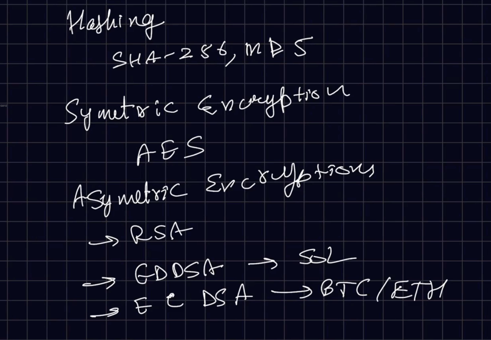

# 🔐 Hashing vs Encryption (Big Picture)

Both **hashing** and **encryption** transform data, but they are built for **very different goals**:

| Aspect      | Hashing                                 | Encryption                           |
| ----------- | --------------------------------------- | ------------------------------------ |
| Purpose     | Verify integrity / store secrets safely | Protect data so it can be read later |
| Reversible? | ❌ No                                    | ✅ Yes (with key)                     |
| Uses a key? | ❌ No                                    | ✅ Yes                                |
| Output      | Fixed-length hash                       | Ciphertext (variable length)         |
| Common use  | Password storage                        | Secure communication, data storage   |

---

## 🔹 Hashing (Deep Explanation)


### What hashing **really does**

Hashing converts **any input** (short or long) into a **fixed-size string**.

Example:

```
"hello" → 2cf24dba5fb0a30e26e83b2ac5b9e29e...
"hello!" → totally different hash
```

Even a **1-character change** completely changes the output.

---

### Key Properties of Hashing

#### 1️⃣ One-way (Irreversible)

You **cannot** get the original data back.

> If you hash a password, there is **no decrypt button**.

This is why hashing is perfect for **passwords**.

---

#### 2️⃣ Deterministic

Same input → same output
Useful for verification.

Example:

* Login system hashes entered password
* Compares it with stored hash
* If hashes match → password is correct

---

#### 3️⃣ Fixed length

No matter how large the input is:

* SHA-256 → always **256 bits**
* MD5 → always **128 bits**

---

### Common Hashing Algorithms

| Algorithm           | Status               | Notes                          |
| ------------------- | -------------------- | ------------------------------ |
| **MD5**             | ❌ Broken             | Fast but insecure (collisions) |
| **SHA-1**           | ❌ Deprecated         | Collision attacks exist        |
| **SHA-256**         | ✅ Secure             | Widely used                    |
| **bcrypt / argon2** | ⭐ Best for passwords | Slow & salted                  |

⚠️ **MD5 should NEVER be used for passwords**

---

### Where Hashing Is Used

* Password storage
* File integrity checks
* Digital signatures
* Blockchain (block linking)

---

## 🔹 Encryption (Deep Explanation)


### What encryption actually means

Encryption **locks data** so that:

* Unauthorized users see garbage
* Authorized users can restore original data using a **key**

```
Plaintext → Encryption + Key → Ciphertext
Ciphertext → Decryption + Key → Plaintext
```

---

### Key Characteristics Explained

#### ✅ Reversible

Encryption is designed to be undone — **but only with the correct key**.

#### 🔑 Key-dependent

Security does **NOT** rely on hiding the algorithm.
It relies on:

> **Keeping the key secret**

This is a core cryptography principle.

---

## 🔹 Symmetric Encryption (In Detail)


### How it works

* Same key encrypts and decrypts data
* Extremely fast
* Used for large data

```
Key → Encrypt → Ciphertext
Key → Decrypt → Original Data
```

---

### Real-life analogy

🔑 **Single key lock**

* One key opens and closes the door
* If key is stolen → security breaks

---

### Your Code Explained (Line by Line Conceptually)

```javascript
// Import Node.js built-in cryptography module
// This module provides cryptographic functionality like hashing and encryption
const crypto = require('crypto');

// Generate a random secret key
// 32 bytes = 256 bits → required size for AES-256 encryption
// This key must remain secret; anyone with this key can decrypt the data
const key = crypto.randomBytes(32);

// Generate an Initialization Vector (IV)
// IV adds randomness to encryption so that the same plaintext
// does NOT produce the same ciphertext every time
// 16 bytes is required for AES block size
const iv = crypto.randomBytes(16);

// Function to encrypt plaintext data
function encrypt(text) {

    // Create a Cipher object using:
    // - AES-256-CBC encryption algorithm
    // - Secret key
    // - Initialization Vector (IV)
    const cipher = crypto.createCipheriv('aes-256-cbc', key, iv);

    // Encrypt the plaintext:
    // - Input encoding: utf8 (normal string)
    // - Output encoding: hex (readable encrypted format)
    let encrypted = cipher.update(text, 'utf8', 'hex');

    // Finalize encryption and append any remaining encrypted data
    encrypted += cipher.final('hex');

    // Return the encrypted text (ciphertext)
    return encrypted;
}

// Function to decrypt encrypted data
function decrypt(encryptedText) {

    // Create a Decipher object using the SAME:
    // - Algorithm
    // - Key
    // - IV
    // If any of these change, decryption will fail
    const decipher = crypto.createDecipheriv('aes-256-cbc', key, iv);

    // Decrypt the ciphertext:
    // - Input encoding: hex
    // - Output encoding: utf8 (original readable string)
    let decrypted = decipher.update(encryptedText, 'hex', 'utf8');

    // Finalize decryption and append remaining plaintext
    decrypted += decipher.final('utf8');

    // Return the original plaintext
    return decrypted;
}

// Example plaintext message to encrypt
const textToEncrypt = 'Hello, World!';

// Encrypt the plaintext
const encryptedText = encrypt(textToEncrypt);

// Decrypt the encrypted text back to original plaintext
const decryptedText = decrypt(encryptedText);

// Output results
console.log('Original Text:', textToEncrypt);
console.log('Encrypted Text:', encryptedText);
console.log('Decrypted Text:', decryptedText);

```
---

### Encryption flow in your function

1. Convert plaintext → encrypted hex
2. Append remaining encrypted blocks
3. Return ciphertext

---

### Decryption flow

Exact reverse process using:

* Same algorithm
* Same key
* Same IV

If **any one of these changes → decryption fails**

---

### Where symmetric encryption is used

* HTTPS (after handshake)
* Disk encryption
* Database field encryption
* Secure messaging

---

## 🔹 Asymmetric Encryption (In Detail)


### How it works

Uses **two keys**:

* 🔓 Public key → encrypt
* 🔐 Private key → decrypt

```
Public Key → Encrypt
Private Key → Decrypt
```

---

### Why this is powerful

You can:

* Share public key with **anyone**
* Keep private key **secret**
* Still communicate securely

---

### Real-life analogy

📬 **Letterbox**

* Anyone can drop a letter (public key)
* Only owner can open box (private key)

---

### Pros & Cons

| Pros                    | Cons               |
| ----------------------- | ------------------ |
| No shared secret needed | Very slow          |
| Secure key exchange     | Not for large data |

---

### Where asymmetric encryption is used

* SSL/TLS handshakes
* Digital signatures
* Email encryption
* Blockchain wallets

---

## 🔹 Why Both Are Used Together

In HTTPS:

1. Asymmetric encryption → exchange symmetric key securely
2. Symmetric encryption → encrypt actual data (fast)

This gives **security + performance**.

---

## 🔥 Final Intuition Summary

* **Hashing** → irreversible → verification → passwords
* **Encryption** → reversible → confidentiality → data protection
* **Symmetric** → fast → same key
* **Asymmetric** → secure exchange → two keys


---
---
---
---

## 🔐 Asymmetric Encryption (Public-Key Cryptography)


### What it means (in very simple terms)

Asymmetric encryption uses **two keys** instead of one:

* **Public key** → can be shared with anyone
* **Private key** → must be kept secret

What one key encrypts, **only the other key can decrypt**.

👉 Even if someone has your **public key**, they **cannot** find your private key (mathematically impractical).

---

### 🔑 Keys Explained Simply

* **Public Key**

  * Used to **encrypt data**
  * Used to **verify digital signatures**
  * Safe to share

* **Private Key**

  * Used to **decrypt data**
  * Used to **create digital signatures**
  * Must be kept secret (if leaked → identity compromised)

---

## 🧠 Why Asymmetric Encryption Exists

Problem with symmetric encryption:

* You need to **share the secret key first** (not secure)

Asymmetric encryption solves this by:

* Letting anyone encrypt using your **public key**
* Only you can decrypt using your **private key**

---

## 🔢 Common Asymmetric Algorithms (Simple Comparison)


### 1️⃣ RSA (Rivest–Shamir–Adleman)

* Based on **large prime number factorization**
* Very secure but **slow**
* Requires **large keys** (2048/4096 bits)

**Used in:**

* SSL/TLS (older & still supported)
* Secure key exchange

📌 Simple idea:

> Hard to break a number into primes, easy to multiply them

---

### 2️⃣ ECC (Elliptic Curve Cryptography)

* Based on **elliptic curve mathematics**
* Much **faster** and **smaller keys** than RSA
* Same security with fewer bits

📌 Simple idea:

> Easy to move forward on a curve, extremely hard to reverse

#### 🔹 secp256k1

* Used by **Bitcoin & Ethereum**
* Mainly for **key generation & signatures**

---

### 3️⃣ EdDSA (Edwards-curve Digital Signature Algorithm)

* A **signature-only** algorithm (not encryption)
* Faster and safer by design
* Resistant to common implementation mistakes

#### 🔹 ed25519

* Used by **Solana**
* Very fast signature verification

📌 Important:

> EdDSA is mainly for **signing**, not encrypting messages

---

## 📐 Elliptic Curves (Very Simple Intuition)

You don’t need math details, just this idea:

* Pick a **starting point** on a curve
* Keep adding the same point again and again
* Going forward = easy
* Going backward (finding how many steps were taken) = practically impossible

That “number of steps” is your **private key**.

---

## 🔄 Common Elliptic Curves

| Curve     | Used In           |
| --------- | ----------------- |
| secp256k1 | Bitcoin, Ethereum (ECC)|
| ed25519   | Solana            (EdDSA)|

---

## 🌍 Real-World Use Cases of Public-Key Cryptography

### 🔐 SSL / TLS (HTTPS)

* Browser uses server’s **public key**
* Secure connection established
* Actual data encrypted later using symmetric keys

---

### 🖥️ SSH Keys

* Public key stored on server / GitHub
* Private key stays on your machine
* No password needed, very secure

---

### ⛓️ Blockchains & Crypto

* Wallet address = derived from **public key**
* Transactions signed with **private key**
* Network verifies using **public key**

👉 You **prove ownership**, without revealing your private key.

---

## 🧠 Final One-Line Summary

* **Asymmetric encryption** → two keys, no shared secret
* **RSA** → older, slower, big keys
* **ECC** → modern, fast, small keys
* **EdDSA** → best for signatures (Solana)
* **Public key** → share it
* **Private key** → protect it with your life 😄


