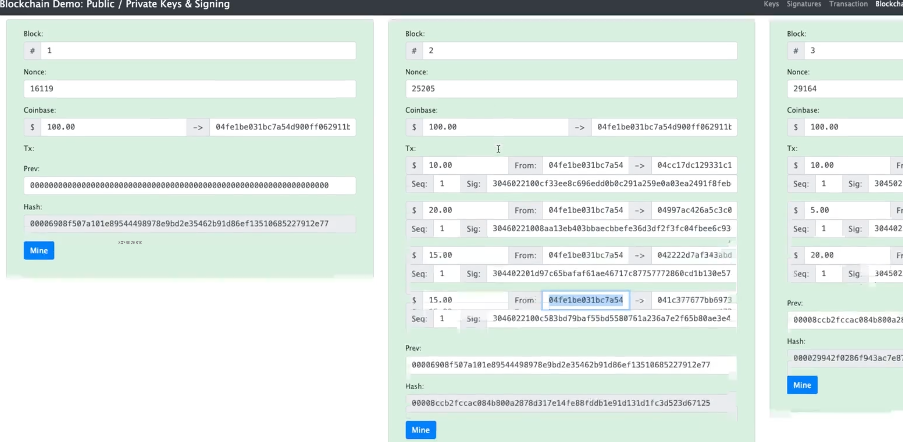

# 🔗 How Do Transactions Work on a Blockchain?

**Reference:** [https://andersbrownworth.com/blockchain/](https://andersbrownworth.com/blockchain/)

At a high level, a blockchain transaction answers three questions:

1. **Who is sending?**
2. **What are they trying to do?**
3. **Can the network trust this request?**

Let’s walk through the full lifecycle of a transaction.


---

## 🧑‍💻 User Side (Transaction Creation)

### 1️⃣ Create a Public / Private Keypair

* The user generates a **cryptographic keypair**

  * **Private key** → secret, stored securely
  * **Public key** → shared, used as identity
* The **wallet address** is derived from the public key

📌 This keypair proves **ownership of funds**, not identity like name/email.

---

### 2️⃣ Create a Transaction

The user constructs a transaction object containing:

* **Recipient address** (e.g., Alice)
* **Amount** (e.g., ₹50)
* **Blockchain-specific metadata**

  * Example:

    * `nonce` (Ethereum)
    * `latestBlockHash` (Solana)
    * `gas / fee`

📌 At this stage, the transaction is just **plain data**, not secure yet.

---

### 3️⃣ Hash the Transaction

* The transaction data is passed through a **cryptographic hash function**
* Output:

  * Fixed-size hash
  * Any small change → completely different hash

Why hashing?

* Ensures **data integrity**
* Produces a fixed-size input for signing
* Makes verification efficient

📌 The hash represents the **exact contents** of the transaction.

---

### 4️⃣ Sign the Transaction

* The user signs the **transaction hash** using their **private key**
* Output: a **digital signature**

What this proves:

* The transaction was created by the owner of the private key
* The transaction data has not been altered

📌 The private key is **never sent** to the network.

---

### 5️⃣ Send Transaction to the Network

The user sends the following to a blockchain node:

```text
{
  rawTransaction,
  transactionHash,
  signature,
  publicKey
}
```

This is broadcast to:

* Validators (PoS chains)
* Miners (PoW chains)

---

## ⛏️ Miner / Validator Side (Transaction Verification)

### 6️⃣ Re-hash the Transaction

* The miner independently hashes the received transaction data
* This ensures:

  * The transaction data was not modified in transit

📌 Hashing must produce the **same hash** as the sender’s.

---

### 7️⃣ Verify the Signature

Using:

* Transaction hash
* Sender’s public key
* Signature

The miner checks:

* Was this signature produced by the corresponding private key?
* Does the signature match the transaction hash?

If verification fails → ❌ transaction rejected.

---

### 8️⃣ Transaction Validation

Beyond cryptography, the miner/validator checks:

* Does the sender have **sufficient balance**?
* Is the transaction **properly formatted**?
* Is the nonce/block hash valid?
* Is the transaction **not a replay or duplicate**?

📌 This step enforces **blockchain rules**, not cryptography.

---

### 9️⃣ Add Transaction to a Block

If everything is valid:

* Transaction is added to a block
* Block is added to the blockchain
* State is updated (balances change)

Transaction becomes:

* Immutable
* Publicly verifiable
* Final (after confirmations)

---

## 🧠 Important Conceptual Clarifications

### ❗ Transactions are usually NOT encrypted

* Anyone can see:

  * Sender
  * Receiver
  * Amount
* What is protected:

  * **Authenticity**
  * **Integrity**
  * **Ownership**

📌 Transparency is a **feature**, not a bug.

---

### 🔐 Where is encryption used then?

* During **network transport** (TLS)
* In **private blockchains**
* In **layer-2 / privacy chains**

But **core blockchain data is public**.

---

## 🔁 Complete Flow Summary (One Glance)

```text
User creates transaction
→ Hashes it
→ Signs hash with private key
→ Sends transaction + signature + public key
→ Miner re-hashes transaction
→ Verifies signature using public key
→ Checks balance & rules
→ Adds transaction to block
```

---

## 🧩 Final Mental Model

* **Hashing** → protects integrity
* **Signing** → proves ownership
* **Public key** → identity
* **Private key** → authority
* **Miners/validators** → independent verifiers

---




---
---
---
---


# ⛓️ Blockchain Explained from Scratch (Genesis → Blocks → Proof of Work)


---

## 1️⃣ What is a Blockchain (at its core)?

A **blockchain** is:

> A **linked list of blocks**, where
> each block contains **data + a cryptographic hash of the previous block**

This creates:

* Immutability
* Tamper resistance
* Trust without a central authority

---

## 2️⃣ The Genesis Block (Block #0)

### What is the Genesis Block?

* The **first block** in the blockchain
* Hard-coded into the protocol
* Has **no previous block**

```
Block 0 (Genesis Block)
previousHash = "0"
```

📌 Every blockchain starts here.
📌 All future blocks depend on it.

---

## 3️⃣ What is inside a Block?


A block has **two main parts**:

### 🔹 Block Header

Contains:

* `previousBlockHash`
* `merkleRoot` (summary of transactions)
* `timestamp`
* `nonce`
* `difficulty`

### 🔹 Block Body

Contains:

* Multiple **transactions**

---

## 4️⃣ Transactions: What Users Actually Create

Each **transaction** includes:

* Sender address (derived from public key)
* Receiver address
* Amount
* Fees
* Chain-specific metadata

📌 Transactions are **not encrypted**
📌 They are **digitally signed**

---

## 5️⃣ Hashing the Transaction

Before signing:

1. Transaction data → **hash**
2. Hash is fixed-size and unique
3. Any change → completely different hash

```
transactionData → SHA-256 → transactionHash
```

Why hashing?

* Integrity
* Efficiency
* Signature works on fixed-size input

---

## 6️⃣ Signing the Transaction (VERY IMPORTANT)

The user:

* Takes the **transaction hash**
* Signs it using their **private key**
* Produces a **digital signature**

This proves:

* Ownership of funds
* Transaction authenticity
* Transaction was not modified

📌 **Private key is NEVER shared**

---

## 7️⃣ Broadcasting to the Network

User sends to a node:

```text
transaction data
+ signature
+ public key
```

The node shares it with:

* Miners (Proof of Work)
* Validators (Proof of Stake)

---

## 8️⃣ What Miners Do (Before Mining)

Before mining, miners **verify**:

### 1️⃣ Signature Verification

* Re-hash transaction
* Verify signature using public key

### 2️⃣ Transaction Validity

* Sufficient balance?
* Correct nonce / blockhash?
* No double-spending?

Only **valid transactions** are accepted.

---

## 9️⃣ Grouping Transactions into a Block

Miners:

* Pick many valid transactions
* Put them into a **candidate block**
* Compute a **Merkle Tree**

### Merkle Root

* Single hash summarizing **all transactions**
* If one transaction changes → Merkle root changes

---

## 🔟 Proof of Work (The Core Idea)

### The Goal

Find a number (**nonce**) such that:

```
hash(blockHeader + nonce) 
starts with N leading zeros
```

Example:

```
000000af3c91b7e...
```

This is the **difficulty requirement**.

---

## 1️⃣1️⃣ What is a Nonce?

Nonce = **Number Used Once**

* Arbitrary number
* Miners keep changing it
* Only purpose: change hash output

---

## 1️⃣2️⃣ Why This is Hard (But Verifiable)

### Mining is hard because:

* Hash functions are unpredictable
* No shortcut exists
* Must brute-force nonce

### Verification is easy because:

* Anyone can hash once
* Instantly check leading zeros

📌 This is **asymmetric effort**

* Hard to produce
* Easy to verify

---

## 1️⃣3️⃣ Mining Loop (Simplified)

```text
nonce = 0
while true:
  hash = SHA256(blockHeader + nonce)
  if hash starts with required zeros:
    SUCCESS
  else:
    nonce++
```

This can take:

* Millions / billions of attempts

---

## 1️⃣4️⃣ Block Found 🎉

When a miner succeeds:

* They broadcast the block to the network
* Other nodes verify:

  * Hash validity
  * Transactions
  * Previous block hash

If valid:

* Block is accepted
* Added to the chain

---

## 1️⃣5️⃣ Linking Blocks Together

Each block contains:

```
previousBlockHash
```

So the chain looks like:

```text
Block 0 → Block 1 → Block 2 → Block 3
```

If someone changes Block 1:

* Hash changes
* Block 2 becomes invalid
* Entire chain breaks

---

## 1️⃣6️⃣ Why Blockchain Is Immutable

To alter a past block:

* Re-mine that block
* Re-mine ALL following blocks
* Beat the rest of the network

This is **computationally infeasible**.

---

## 1️⃣7️⃣ Why More Confirmations = More Security

Each new block:

* Adds more work on top
* Makes rewriting history harder

That’s why:

* Bitcoin waits ~6 confirmations

---

## 🔐 Important Clarifications

### ❌ Signatures are NOT encryption

* Transactions are public
* Signatures prove authenticity

### 🔐 Encryption happens:

* During network transport (TLS)
* Not inside blockchain data

---

## 🧠 Final Mental Model (Remember This)

* **Hashing** → integrity
* **Signing** → ownership
* **Merkle root** → transaction summary
* **Nonce** → PoW randomness
* **Leading zeros** → difficulty
* **Previous hash** → immutability
* **Mining** → security through work

---

## 🔥 One-Line Summary

> Blockchain is a system where **signed transactions** are grouped into blocks,
> blocks are linked by hashes,
> and miners prove computational work by finding a nonce that produces a hash with required difficulty — making history **tamper-proof and trustless**.

---

