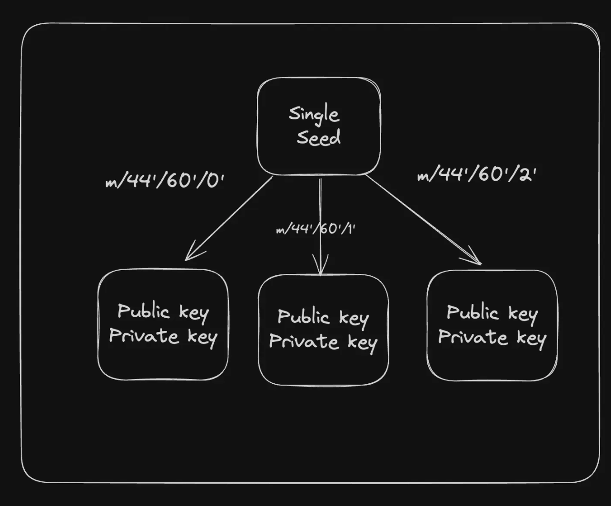
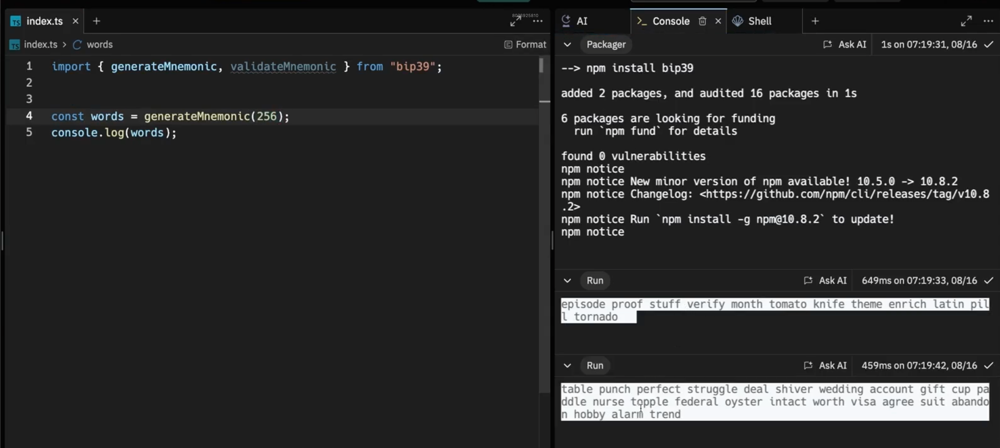
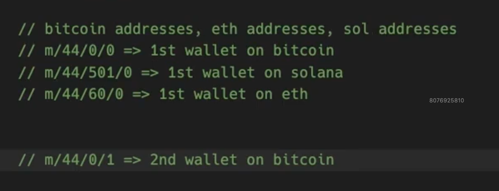

# 🌳 Hierarchical Deterministic (HD) Wallet


## What is an HD Wallet? (Simple Definition)



A **Hierarchical Deterministic (HD) wallet** is a wallet that can:

> Generate **many public–private key pairs**
> from **one single master seed**,
> in a **tree-like (hierarchical) structure**.

This means:

* One seed → unlimited wallets
* Lose device → recover everything from seed
* No need to store many private keys

---

## 🧩 The Core Idea (Very Important)

HD wallets are based on **deterministic key generation**:

* **Deterministic** → same seed always generates the same keys
* **Hierarchical** → keys are arranged like a family tree

```
Master Seed
 └── Master Private Key
     ├── Account 1
     │   ├── Address 1
     │   ├── Address 2
     ├── Account 2
     │   ├── Address 1
     │   ├── Address 2
```

---

## ❌ The Problem (Before HD Wallets)

### What was the old situation?

If you wanted:

* Multiple wallets
* Multiple addresses
* Better privacy

You had to:

* Generate **many independent keypairs**
* Store **each private key separately**

### Problems with this approach

* Hard to manage many private keys
* Losing keys = losing funds
* Backups were complex
* Recovery was painful

📌 Example:

> If you had 50 addresses → you had to back up 50 private keys

---

## ✅ The Solution: One Seed to Rule Them All

HD wallets solve this by using:

* **One master seed**
* Deterministic key derivation
* Tree-based structure

Now:

* Back up **once**
* Restore **everything**

---

## 🔐 What is the “Seed”?

The **seed** is:

* A large random number
* Usually shown as **12 or 24 words** (mnemonic phrase)

Example:

```
seed phrase = "gravity machine north sort system female..."
```

📌 This seed is the **root of the entire wallet tree**.

If you have the seed:

* You have **all keys**
* You have **all funds**

---

## 🌱 How Keys Are Derived (Conceptually)

From the seed:

1. A **master private key** is created
2. From it, child keys are derived
3. Each child can create more children

Important:

* Child keys can be generated **without exposing parent keys**
* Keys are mathematically related but secure

---

## 📜 BIP-32 (Bitcoin Improvement Proposal 32)


### What is BIP-32?

**BIP-32** is a standard that defines:

> How to generate a **hierarchical tree of keys**
> from a **single master seed**

It was proposed in **2012** by **Pieter Wuille**, a Bitcoin Core developer.

---

### What BIP-32 Introduced

BIP-32 introduced:

* **Master key → child keys**
* Deterministic derivation
* Standardized wallet structure

So all wallets following BIP-32:

* Behave predictably
* Can be recovered across compatible apps

---

## 🔑 Extended Keys (xpub / xprv)

BIP-32 defines two important concepts:

### 🔐 xprv (Extended Private Key)

* Can generate:

  * Private keys
  * Public keys
* **Very sensitive**

### 🔓 xpub (Extended Public Key)

* Can generate:

  * Public keys only
* Safe to share
* Used by:

  * Watch-only wallets
  * Exchanges
  * Account monitoring

📌 This allows:

> One device to **watch balances**
> Another device to **sign transactions**

---

## 🛣️ Derivation Paths (Quick Intuition)

Each key has a **path**, like an address in a tree:

```
m / 44' / 501' / 0' / 0'
```

Meaning:

* `m` → master key
* Each number → a level in the hierarchy

📌 Different blockchains use different paths.

---

## 🧠 Why HD Wallets Are Powerful

### ✅ Security

* One backup (seed phrase)
* Less chance of losing keys

### ✅ Convenience

* Unlimited addresses
* Automatic address generation

### ✅ Privacy

* New address for each transaction
* Harder to link transactions together

### ✅ Recovery

* Lose phone → restore everything
* Change wallet app → funds still accessible

---

## 🚨 Critical Security Warning

If someone gets your **seed phrase**:

* They control **all accounts**
* They control **all addresses**
* They control **all funds**

👉 Seed phrase = master key of your financial life

---

## 🧠 Final Mental Model

Think of an HD wallet like this:

* **Seed** → tree root
* **Accounts** → branches
* **Addresses** → leaves
* **BIP-32** → rulebook for growing the tree

---

## 🔥 One-Line Summary

> An HD wallet uses **one master seed** to deterministically generate a **tree of keypairs**, making wallets **secure, recoverable, scalable**, and easy to manage — and **BIP-32** is the standard that made this possible.

---
---
---
---
---


# 🪪 How to Create a Crypto Wallet (End-to-End)

A modern crypto wallet is **not just one key**.
It is a **system** built using standards like **BIP-39, BIP-32, and derivation paths** so wallets can be **secure, recoverable, and interoperable**.

---

## 🧠 Step 1: Mnemonics (Seed Phrase)


### What is a Mnemonic Phrase?

A **mnemonic phrase** (also called a **seed phrase**) is:

* A **human-readable list of words**
* Used to generate a **cryptographic seed**
* Easy for humans to write down and restore

Example:

```
gravity machine north sort system female filter attitude volume fold club stay
```



---

### Why mnemonics exist

Computers like random binary numbers, but humans don’t.

Mnemonic phrases:

* Represent **random entropy**
* Are easier to back up
* Reduce chances of manual errors

---

### BIP-39 (Bitcoin Improvement Proposal 39)

**BIP-39** defines:

* How mnemonic words are generated
* How words map back to binary entropy
* How entropy is converted into a seed

📌 Official English wordlist:
[https://github.com/bitcoin/bips/blob/master/bip-0039/english.txt](https://github.com/bitcoin/bips/blob/master/bip-0039/english.txt)

* Exactly **2048 words**
* Each word maps cleanly to binary values
* Ensures consistent generation across wallets

---

### Real-world usage (Backpack Wallet)

Backpack implements mnemonic handling here:

* Mnemonic input validation
* Word checking
* Recovery flow

📍 Reference (Backpack):

```
MnemonicInput.tsx (line ~143)
```

---

## 🌱 Step 2: Seed Phrase (Binary Seed)


### What is the Seed?

The **seed** is:

* A **binary number**
* Derived from the mnemonic phrase
* The **true root secret** of the wallet

Mnemonic → Seed → All keys

---

### Code Example (BIP-39)

```js
import { generateMnemonic, mnemonicToSeedSync } from "bip39";

// Generate a random 12-word mnemonic
const mnemonic = generateMnemonic();
console.log("Generated Mnemonic:", mnemonic);

// Convert mnemonic to a binary seed
const seed = mnemonicToSeedSync(mnemonic);
```

📌 Important:

* Mnemonic is for **humans**
* Seed is for **cryptography**
* Seed never needs to be shown to users

---

### Backpack reference (Seed handling)

Backpack derives and manages the seed here:

```
keyring.ts (line ~131)
```

---

## 🌳 Step 3: Derivation Paths (HD Wallet Logic)


### Why Derivation Paths Exist

A single seed can generate:

* Multiple blockchains
* Multiple accounts
* Multiple addresses

But to regenerate the **same keys**, everyone must follow the **same rules**.

👉 That rule system is the **derivation path**.

---

### What is a Derivation Path?

A derivation path is a **structured route** through the HD wallet tree.

General format:

```
m / purpose' / coin_type' / account' / change / address_index
```

---

### Meaning of Each Component

| Part            | Meaning                        |
| --------------- | ------------------------------ |
| `m`             | Master seed (root)             |
| `purpose`       | Wallet standard (44' = BIP-44) |
| `coin_type`     | Blockchain identifier          |
| `account`       | User account number            |
| `change`        | External (0) or internal (1)   |
| `address_index` | Address counter                |

---

### Coin Types (Examples)

| Blockchain | Coin Type |
| ---------- | --------- |
| Bitcoin    | `0'`      |
| Ethereum   | `60'`     |
| Solana     | `501'`    |

📌 This is why the **same seed** works across Phantom, Backpack, Ledger, etc.



---

## 🔑 Step 4: Deriving Keys (Solana Example)

Below is a **real Solana wallet derivation flow** using ED25519.

---

### Code: Mnemonic → Seed → Solana Addresses

```js
import nacl from "tweetnacl";
import { generateMnemonic, mnemonicToSeedSync } from "bip39";
import { derivePath } from "ed25519-hd-key";
import { Keypair } from "@solana/web3.js";

// Generate mnemonic and seed
const mnemonic = generateMnemonic();
const seed = mnemonicToSeedSync(mnemonic);

// Derive multiple Solana accounts
for (let i = 0; i < 4; i++) {
  const path = `m/44'/501'/${i}'/0'`; // Solana derivation path

  // Derive child seed using path
  const derivedSeed = derivePath(path, seed.toString("hex")).key;

  // Create keypair from derived seed
  const secret = nacl.sign.keyPair.fromSeed(derivedSeed).secretKey;

  // Convert to Solana keypair and print public key
  console.log(Keypair.fromSecretKey(secret).publicKey.toBase58());
}
```

---

### What’s happening conceptually

1. **Mnemonic** → human backup
2. **Seed** → master secret
3. **Derivation path** → choose branch
4. **Derived seed** → child key material
5. **Keypair** → blockchain identity

📌 Same mnemonic + same path = same wallet forever

---

## 🔁 Why Derivation Paths Matter (Interoperability)

If you:

* Move from **Phantom → Backpack**
* Restore wallet on **Ledger**
* Reinstall wallet app

As long as:

* Mnemonic is the same
* Derivation path is the same

👉 You get **identical addresses and balances**

---

## 🧠 Mental Model (Very Important)

Think of wallet creation like this:

```
Mnemonic (words)
   ↓
Seed (binary root)
   ↓
Derivation Path (route)
   ↓
Private Key
   ↓
Public Key
   ↓
Wallet Address
```

---

## 🚨 Security Truth (Must Remember)

* Mnemonic phrase = **ALL your money**
* Anyone with it:

  * Can derive all accounts
  * Can sign transactions
* Never store it digitally
* Never share screenshots

---

## 🔥 One-Line Summary

> A crypto wallet is created by generating a **mnemonic (BIP-39)**, converting it into a **seed**, and using **derivation paths** to deterministically derive private keys and addresses — ensuring security, recoverability, and compatibility across wallets.

---
